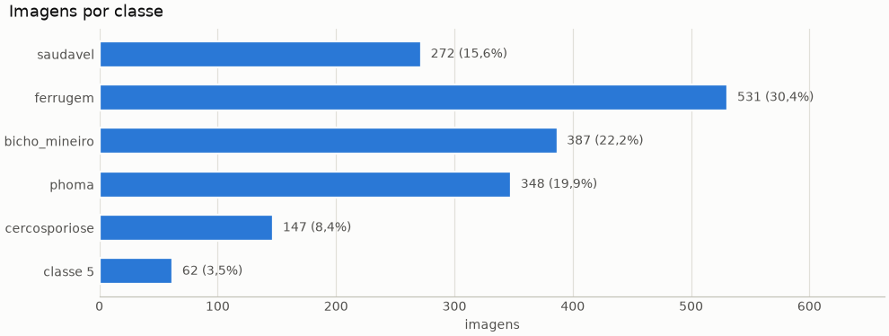
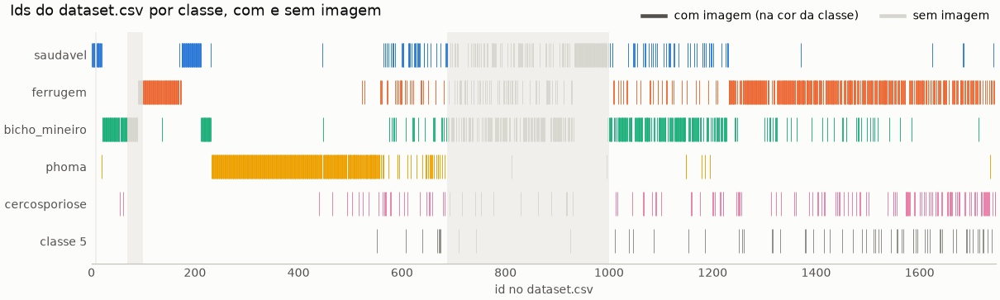
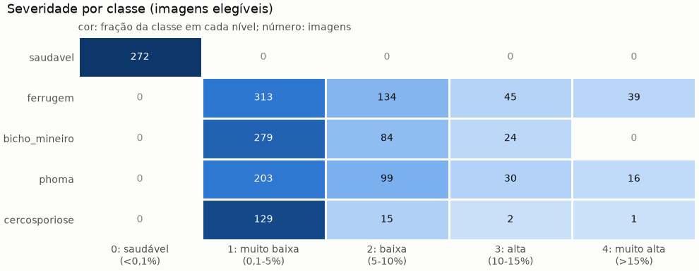
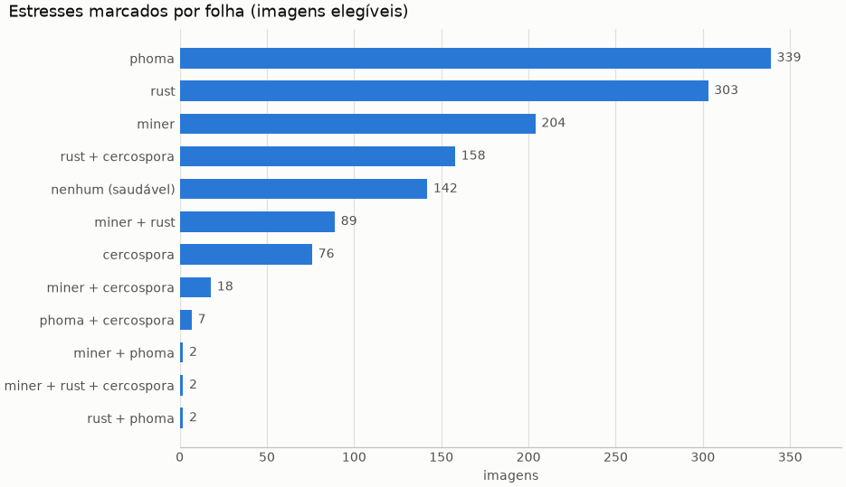
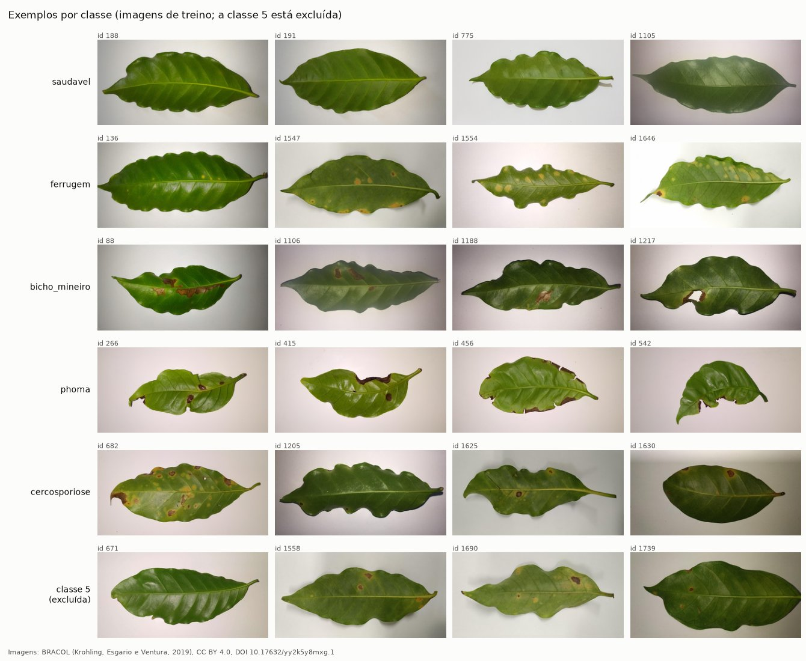
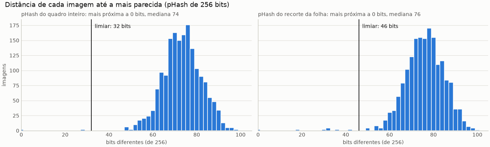
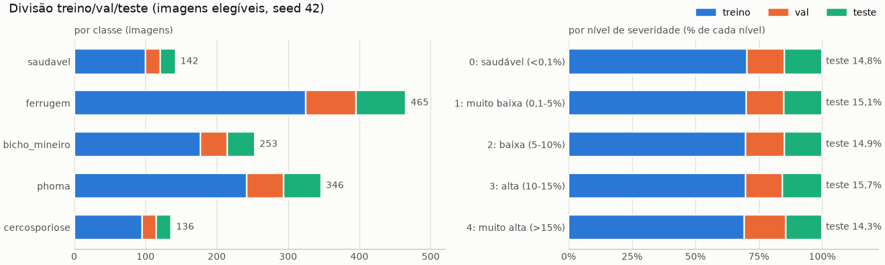
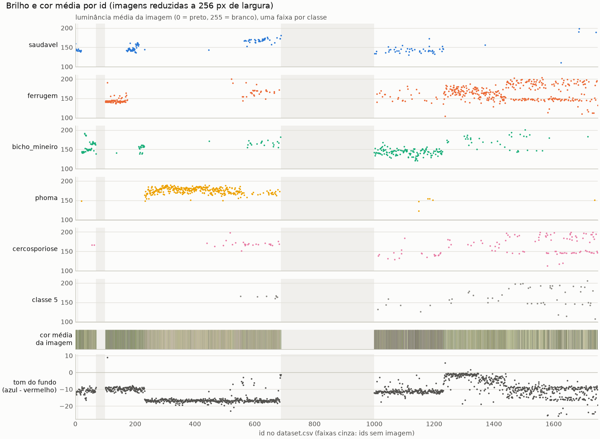

# EDA do BRACOL

Gerado por `python data/eda_bracol.py` a partir de `data/manifests/bracol.csv`. Não editar à mão: rode o script de novo. O notebook `notebooks/01_eda.ipynb` mostra as mesmas tabelas e figuras; as figuras ficam em `data/reports/figures/` para a documentação (Frente 12).

> **Cópia completa do BRACOL:** 1.747 imagens. Sem a classe 5 são 1.685, as mesmas imagens que os autores usaram, mas a divisão é outra (seed 42): comparar com Esgario et al. (2020) só com essa ressalva.
>
> **Ressalva:** A correspondência das colunas 'phoma' e 'cercospora' do dataset.csv (códigos 3 e 4 de predominant_stress) com as classes 'brown leaf spot' e 'cercospora leaf spot' de Esgario et al. (2020) ainda não foi confirmada. Aqui elas viram as classes 'phoma' e 'cercosporiose' do projeto. O mesmo vale para as pastas 'Phoma' e 'Cerscospora' do JMuBEN: viram 'phoma' e 'cercosporiose' sem confirmação de que nomeiam as mesmas doenças do BRACOL.
>
> **Classe 5** (`predominant_stress = 5`, "undetermined" no leaf/legend.txt): 62 linhas, 62 com imagem. Fica fora de classificação, severidade e multirrótulo.

Todas as 1.747 imagens têm 2048x1024 pixels, por isso não há figura de resolução.

## 1. Classes

| classe | imagens | % do total |
|---|---:|---:|
| saudavel | 272 | 15,6% |
| ferrugem | 531 | 30,4% |
| bicho_mineiro | 387 | 22,2% |
| phoma | 348 | 19,9% |
| cercosporiose | 147 | 8,4% |
| classe 5 | 62 | 3,5% |

A maior classe é ferrugem (531 imagens) e a menor, cercosporiose (147): razão de 3,6 para 1. A classe 5 (62 imagens) fica fora.

## 2. Classes ao longo dos ids

As classes aparecem em blocos de ids seguidos: as três sequências mais longas da mesma classe são 232-438 (phoma, 207 ids); 933-995 (saudavel, 63 ids); 90-136 (ferrugem, 47 ids). Se cada bloco corresponder a uma sessão de foto, classe e sessão se confundem (ver a seção 8).

## 3. Severidade por classe

| classe | 0 | 1 | 2 | 3 | 4 |
|---|---:|---:|---:|---:|---:|
| saudavel | 272 | 0 | 0 | 0 | 0 |
| ferrugem | 0 | 313 | 134 | 45 | 39 |
| bicho_mineiro | 0 | 279 | 84 | 24 | 0 |
| phoma | 0 | 203 | 99 | 30 | 16 |
| cercosporiose | 0 | 129 | 15 | 2 | 1 |

Níveis: 0 = saudável (<0,1%); 1 = muito baixa (0,1-5%); 2 = baixa (5-10%); 3 = alta (10-15%); 4 = muito alta (>15%) da área da folha.

O nível 1, muito baixa (0,1-5%), é o mais comum: 924 de 1.685 imagens elegíveis (54,8%). Combinações de classe e nível com menos de 5 imagens: bicho_mineiro/4: 0, cercosporiose/3: 2, cercosporiose/4: 1. Métricas de severidade nessas combinações ficam muito incertas.

## 4. Mais de um estresse na mesma folha

| estresses marcados | imagens |
|---|---:|
| rust | 348 |
| phoma | 341 |
| miner | 322 |
| nenhum (saudável) | 272 |
| rust + cercospora | 164 |
| miner + rust | 113 |
| cercospora | 87 |
| miner + cercospora | 24 |
| phoma + cercospora | 7 |
| rust + phoma | 3 |
| miner + phoma | 2 |
| miner + rust + cercospora | 2 |

315 das 1.685 imagens elegíveis (18,7%) têm mais de um estresse marcado; a combinação mais comum é rust + cercospora (164). A classe do projeto usa só o estresse predominante; as colunas `miner`, `rust`, `phoma` e `cercospora` guardam o multirrótulo.

## 5. Exemplos por classe

Quatro imagens de treino por classe, sorteadas de forma determinística (seed 42); a última linha mostra a classe 5, que está excluída. Imagens: BRACOL (Krohling, Esgario e Ventura, 2019), CC BY 4.0, DOI 10.17632/yy2k5y8mxg.1.

## 6. Duplicatas e folhas repetidas

Para cada imagem, a distância até a mais parecida por dois pHash de 256 bits: o do quadro inteiro e o do recorte da folha. A mais próxima fica a 0 bits no quadro (mediana 74) e a 0 bits na folha (mediana 76). Imagens com SHA-256 repetido: 2.

Grupos com mais de uma imagem: 8 (469/471; 758/759; 760/764; 813/1022; 1295/1296; 1352/1356; 1692/1694; 1715/1722). Uma imagem entra no grupo de outra se o SHA-256 for igual, se o pHash do quadro ficar a até 32 bits, se o da folha ficar a até 46 bits, ou se o par estiver na lista de folhas repetidas conferidas visualmente em 07/10/2026; um grupo nunca se divide entre splits. A tabela de cada par, com os rótulos e as duas distâncias, está em `data/reports/integridade_bracol.md`.

O pHash do quadro pega a mesma foto re-salva, redimensionada ou com outro brilho, mas o fundo e a luz pesam muito nele; o da folha pega boa parte das fotos repetidas da mesma folha. Os pares não agrupados mais próximos ficam a 48 bits no quadro (131/140) e a 50 bits na folha (134/160).

## 7. Divisão treino/val/teste

| classe | treino | val | teste | total |
|---|---:|---:|---:|---:|
| saudavel | 190 | 41 | 41 | 272 |
| ferrugem | 372 | 79 | 80 | 531 |
| bicho_mineiro | 271 | 58 | 58 | 387 |
| phoma | 244 | 52 | 52 | 348 |
| cercosporiose | 103 | 22 | 22 | 147 |
| **total** | 1.180 | 252 | 253 | 1.685 |

Estratificada por classe (70/15/15, seed 42), com os níveis de severidade espalhados: a fração de teste fica entre 14,3% e 15,1% em todos os níveis. Com 253 imagens de teste, uma acurácia observada de 90% tem intervalo de confiança de 95% (Wilson) de 85,7% a 93,1%.

## 8. Brilho e cor média por id (indícios de sessões de foto)

Medidas numa versão reduzida de cada imagem (256 px de largura):

- **luminância**: média da imagem em tons de cinza, de 0 (preto) a 255 (branco);
- **cor média**: média de R, G e B da imagem inteira (a faixa colorida da figura);
- **fundo**: faixas de cima e de baixo, 1/8 da altura cada, que nessas fotos em geral só têm fundo. O **tom** é azul menos vermelho: quanto mais negativo, mais amarelado.

Medianas por faixa de 100 ids (faixas sem imagem não aparecem); a dispersão do tom é a distância interquartil dentro da faixa:

| ids | imagens | luminância | luminância do fundo | tom do fundo | dispersão do tom | classes mais comuns |
|---|---:|---:|---:|---:|---:|---|
| 1-100 | 100 | 146,5 | 188,5 | -10,3 | 1,9 | bicho_mineiro 67, saudavel 19 |
| 101-200 | 100 | 142,8 | 179,2 | -9,6 | 1,5 | ferrugem 71, saudavel 28 |
| 201-300 | 100 | 169,4 | 202,7 | -16,2 | 5,7 | phoma 69, bicho_mineiro 19 |
| 301-400 | 100 | 179,5 | 211,1 | -16,8 | 0,9 | phoma 100 |
| 401-500 | 100 | 177,9 | 212,0 | -16,7 | 0,9 | phoma 95, cercosporiose 3 |
| 501-600 | 100 | 169,5 | 206,9 | -16,7 | 1,1 | phoma 56, ferrugem 15 |
| 601-700 | 100 | 168,3 | 211,5 | -16,6 | 1,5 | saudavel 29, bicho_mineiro 21 |
| 701-800 | 100 | 170,4 | 214,6 | -2,2 | 3,6 | bicho_mineiro 41, ferrugem 27 |
| 801-900 | 100 | 170,1 | 216,4 | -2,1 | 1,7 | bicho_mineiro 46, ferrugem 25 |
| 901-1000 | 100 | 167,8 | 210,3 | -11,5 | 11,7 | saudavel 73, bicho_mineiro 19 |
| 1001-1100 | 100 | 144,4 | 186,6 | -11,4 | 0,9 | bicho_mineiro 58, saudavel 16 |
| 1101-1200 | 100 | 142,9 | 182,0 | -11,2 | 1,1 | bicho_mineiro 56, saudavel 22 |
| 1201-1300 | 100 | 161,6 | 209,7 | -2,2 | 9,5 | ferrugem 61, bicho_mineiro 19 |
| 1301-1400 | 100 | 165,0 | 212,6 | -3,0 | 4,2 | ferrugem 73, bicho_mineiro 13 |
| 1401-1500 | 100 | 168,7 | 207,7 | -8,8 | 5,4 | ferrugem 66, cercosporiose 16 |
| 1501-1600 | 100 | 178,2 | 218,9 | -10,5 | 3,6 | ferrugem 64, cercosporiose 16 |
| 1601-1700 | 100 | 154,8 | 199,5 | -10,5 | 6,4 | ferrugem 56, cercosporiose 30 |
| 1701-1747 | 47 | 152,7 | 193,6 | -10,3 | 6,1 | ferrugem 20, cercosporiose 17 |

Medianas por classe:

| classe | imagens | luminância | luminância do fundo | tom do fundo |
|---|---:|---:|---:|---:|
| saudavel | 272 | 158,0 | 195,5 | -11,1 |
| ferrugem | 531 | 160,5 | 203,6 | -8,8 |
| bicho_mineiro | 387 | 156,5 | 196,5 | -10,1 |
| phoma | 348 | 176,3 | 209,7 | -16,7 |
| cercosporiose | 147 | 167,0 | 206,8 | -10,9 |
| classe 5 | 62 | 160,7 | 203,4 | -11,3 |

**O que a figura mostra.** Nesta cópia, brilho e cor mudam por blocos de ids: faixas vizinhas têm valores parecidos e há saltos entre blocos. Entre as faixas de 100 ids com pelo menos 20 imagens, a mediana do tom do fundo vai de -16,8 (ids 301-400: phoma 100) a -2,1 (ids 801-900: bicho_mineiro 46, ferrugem 25), e a da luminância do fundo, de 179,2 a 218,9. Os blocos coincidem em parte com os blocos de classe do csv: phoma, com 90% das imagens entre os ids 248 e 654, tem o fundo mais amarelado (mediana -16,7) do que as outras classes (-11,1 a -8,8). Dentro de uma mesma classe o tom também varia entre faixas: em ferrugem, a mediana por faixa com pelo menos 20 imagens dessa classe vai de -13,4 a -1,5. Em 9 das 18 faixas o tom do fundo é homogêneo (dispersão de no máximo 2); nas outras (201-300, 701-800, 901-1000, 1201-1300, 1301-1400, 1401-1500, 1501-1600, 1601-1700, 1701-1747), a figura mostra um bloco que termina no meio da faixa ou dois níveis que se alternam.

**O que a figura não mostra.** Não prova que houve sessões de foto diferentes: o BRACOL não traz data, câmera nem planta, e a média da imagem inteira também depende do tamanho da folha e da cor das lesões. O padrão é compatível com sessões diferentes (luz, câmera ou balanço de branco), algumas concentradas em uma classe. Se for isso, um modelo pode aprender a cor do fundo junto com a lesão, e a divisão aleatória por imagem põe fotos da mesma sessão em treino e teste. Vale checar na Frente 9: Grad-CAM nas imagens de teste e acurácia por faixa de ids.
