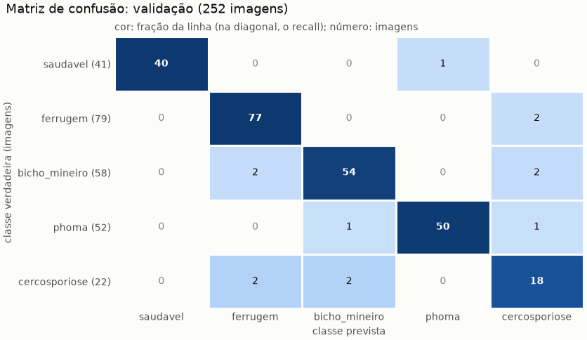

# Treino-base do classificador: run `base_resnet50_bracol`

Gerado por `python model/train.py --nome base_resnet50_bracol` em 09/10/2026 18:58, no commit `3273cd8` (com alterações não commitadas).

## Configuração

- **Modelo:** `resnet50` do timm, pré-treinado no ImageNet (pesos `timm/resnet50.a1_in1k`), com duas cabeças lineares sobre as features: classe (5 saídas, na ordem de `CLASSES`) e severidade (níveis 0 a 4).
- **Perda:** CE(classe) + 1 × CE(severidade); as linhas sem alvo de severidade ficam fora da média.
- **Entrada:** 448x224 (largura x altura), redimensionada com `INTER_AREA` e normalizada com a média e o desvio do ImageNet.
- **Otimização:** AdamW (lr 0,0001, weight decay 0,0001), cosseno, até 30 épocas, batch 32, parada antecipada pelo F1 macro da validação (paciência 8), semente 42.
- **RD02, só no treino:** amostragem balanceada por classe (peso 1/frequência da classe, 1.180 sorteios por época, com reposição) e augmentation moderada, em memória: espelhamento horizontal e vertical, rotação de até 15° e brilho e contraste de até ±10%. A validação fica intacta.
- **Execução:** cuda, com AMP; 22 épocas rodadas, 19,9 s por época em média, pico de 3,5 GB de memória da GPU reservada pelo PyTorch; parada antecipada na época 22: 8 épocas sem melhorar o F1 macro da validação.

## Dados

| classe | treino | validação |
|---|---:|---:|
| saudavel | 190 | 41 |
| ferrugem | 372 | 79 |
| bicho_mineiro | 271 | 58 |
| phoma | 244 | 52 |
| cercosporiose | 103 | 22 |
| **total** | **1.180** | **252** |

- **Fontes:** treino com bracol 1.180; validação com bracol 252.
- O JMuBEN não entra neste treino.
- **Cercosporiose: 22 imagens na validação.** Cada uma vale 4,5 pontos de recall dessa classe, que por isso oscila muito.

## Validação (melhor época: 14)

- **Acurácia:** 94,8% (239 de 252 imagens; intervalo de Wilson de 95%: 91,4% a 97,0%).
- **F1 macro:** 93,2% (média simples do F1 das 5 classes).

| classe | imagens | precisão | recall | F1 |
|---|---:|---:|---:|---:|
| saudavel | 41 | 100,0% | 97,6% | 98,8% |
| ferrugem | 79 | 95,1% | 97,5% | 96,2% |
| bicho_mineiro | 58 | 94,7% | 93,1% | 93,9% |
| phoma | 52 | 98,0% | 96,2% | 97,1% |
| cercosporiose | 22 | 78,3% | 81,8% | 80,0% |

Matriz de confusão (linhas: classe verdadeira; colunas: classe prevista):

| classe verdadeira | saudavel | ferrugem | bicho_mineiro | phoma | cercosporiose |
|---|---:|---:|---:|---:|---:|
| saudavel | 40 | 0 | 0 | 1 | 0 |
| ferrugem | 0 | 77 | 0 | 0 | 2 |
| bicho_mineiro | 0 | 2 | 54 | 0 | 2 |
| phoma | 0 | 0 | 1 | 50 | 1 |
| cercosporiose | 0 | 2 | 2 | 0 | 18 |

**Severidade** (níveis 0 a 4; 252 imagens com alvo):

- MAE (em níveis): 0,274; kappa quadrático ponderado: 0,720.
- Acurácia exata: 76,6%; com tolerância de 1 nível: 96,0%.
- Imagens por nível verdadeiro: 0: 41, 1: 138, 2: 49, 3: 15, 4: 9.

## Histórico por época

| época | perda treino | perda val | acurácia val | F1 macro val | recall cercosporiose | MAE sev | kappa sev | tempo (s) |
|---|---:|---:|---:|---:|---:|---:|---:|---:|
| 1 | 3,019 | 2,913 | 35,7% | 35,1% | 77,3% | 0,583 | 0,000 | 21,2 |
| 2 | 2,735 | 2,662 | 57,9% | 57,1% | 63,6% | 0,583 | 0,000 | 20,2 |
| 3 | 2,454 | 2,388 | 61,9% | 57,0% | 54,5% | 0,583 | 0,000 | 20,0 |
| 4 | 2,120 | 2,002 | 72,6% | 67,8% | 59,1% | 0,508 | 0,184 | 19,9 |
| 5 | 1,690 | 1,579 | 80,2% | 77,3% | 68,2% | 0,440 | 0,362 | 19,8 |
| 6 | 1,314 | 1,291 | 86,1% | 83,9% | 86,4% | 0,393 | 0,490 | 19,9 |
| 7 | 1,102 | 1,108 | 89,3% | 87,3% | 86,4% | 0,345 | 0,614 | 19,8 |
| 8 | 0,955 | 0,962 | 90,9% | 88,8% | 81,8% | 0,337 | 0,639 | 19,8 |
| 9 | 0,816 | 0,879 | 93,3% | 91,4% | 81,8% | 0,310 | 0,671 | 19,9 |
| 10 | 0,760 | 0,816 | 92,1% | 89,9% | 77,3% | 0,298 | 0,684 | 19,8 |
| 11 | 0,657 | 0,781 | 92,9% | 90,9% | 86,4% | 0,286 | 0,701 | 19,8 |
| 12 | 0,603 | 0,735 | 93,3% | 91,5% | 81,8% | 0,270 | 0,718 | 19,9 |
| 13 | 0,582 | 0,743 | 92,5% | 90,6% | 72,7% | 0,254 | 0,742 | 19,8 |
| 14 (melhor) | 0,535 | 0,706 | 94,8% | 93,2% | 81,8% | 0,274 | 0,720 | 19,9 |
| 15 | 0,486 | 0,703 | 94,0% | 92,6% | 86,4% | 0,262 | 0,741 | 19,9 |
| 16 | 0,487 | 0,667 | 94,8% | 92,9% | 77,3% | 0,250 | 0,742 | 19,9 |
| 17 | 0,499 | 0,681 | 93,3% | 91,5% | 81,8% | 0,226 | 0,781 | 19,9 |
| 18 | 0,517 | 0,647 | 94,0% | 92,2% | 77,3% | 0,246 | 0,755 | 19,9 |
| 19 | 0,460 | 0,636 | 94,0% | 92,2% | 77,3% | 0,222 | 0,781 | 19,8 |
| 20 | 0,401 | 0,651 | 93,7% | 92,2% | 86,4% | 0,222 | 0,784 | 19,9 |
| 21 | 0,398 | 0,622 | 94,0% | 92,2% | 77,3% | 0,214 | 0,789 | 19,9 |
| 22 | 0,377 | 0,632 | 94,4% | 92,7% | 77,3% | 0,214 | 0,790 | 19,9 |

O recall de cada classe, por época, está em `historico.csv`.

## Ressalvas

- **Phoma e cercosporiose:** A correspondência das colunas 'phoma' e 'cercospora' do dataset.csv (códigos 3 e 4 de predominant_stress) com as classes 'brown leaf spot' e 'cercospora leaf spot' de Esgario et al. (2020) ainda não foi confirmada. Aqui elas viram as classes 'phoma' e 'cercosporiose' do projeto. O mesmo vale para as pastas 'Phoma' e 'Cerscospora' do JMuBEN: viram 'phoma' e 'cercosporiose' sem confirmação de que nomeiam as mesmas doenças do BRACOL.
- **Comparação com Esgario et al. (2020):** as 1.685 imagens elegíveis são as mesmas, mas a divisão é outra. Aqui ela é estratificada por classe (seed 42) e mantém as folhas repetidas no mesmo split; a deles, segundo o repositório dos autores, é aleatória (seed 150), 70/15/15 com rotação em 5 dobras, com entrada de 224x224. Os números não são diretamente comparáveis (ver `data/README.md`).
- **Teste:** não usado aqui. Ele só é avaliado com `python model/train.py --avaliar-teste --run <nome>`, e cada uso fica em `model/runs/uso_do_teste.md`.

