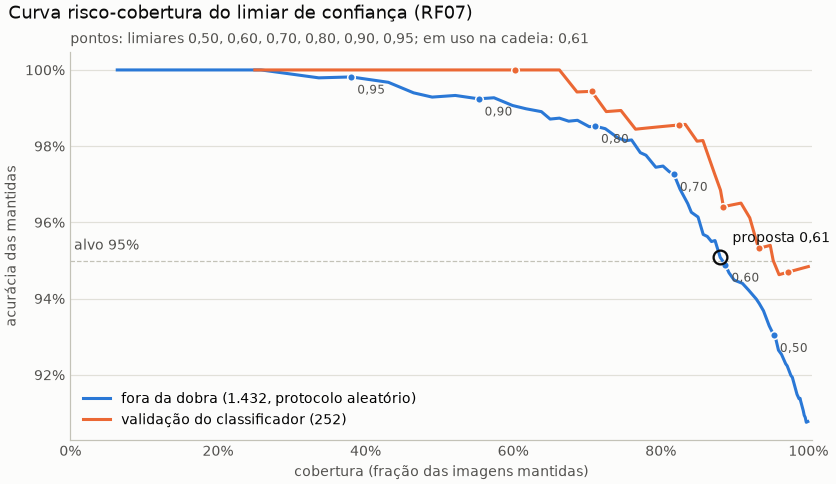

# Inferência ponta a ponta: run `pipeline_base`

Gerado por `python model/avaliar_pipeline.py` em 10/10/2026 12:31, no commit `02033bd` (com alterações não commitadas). Classificador `model/runs/base_resnet50_bracol`, detector `model/runs/detector_base/weights/last.pt`. **Os testes do BRACOL e do BRACOT não foram lidos nem avaliados.** Módulo: `model/inferencia.py`; interface no README (seção "Interface para o backend").

## Decisões do gestor

- **10/10/2026:** o detector está bom o bastante: AP50 de máscara de 94,7% (região) e 88,1% (conservador), limiar 0,35.
- **10/10/2026:** classificar também as folhas cortadas pela borda, com área mínima e corte por confiança do classificador; reavaliar o filtro de borda olhando os recortes.
- **10/10/2026:** folha única: a foto inteira só se houver detecção com score >= 0,05; sem nenhuma, planta_nao_identificada.
- **10/10/2026:** arquivo_muito_grande acima de ~64 megapixels, com as dimensões lidas do cabeçalho.

## Configuração da cadeia

| parâmetro | valor | origem |
|---|---|---|
| limiar_deteccao | 0,35 | decisão do gestor |
| max_folhas | 15 | RNF02 (a validação do BRACOT tem até 13 detecções) |
| area_minima | 0,5% | pedido do gestor (cortadas: T2) |
| saturacao_minima / fracao_colorida_minima | 30 / 25% | filtro de cor, medido no treino (abaixo) |
| limiar_confianca | 0,61 | proposta da curva risco-cobertura; **aguarda a decisão do gestor** |
| recorte | A | T1: só o recorte acerta 92,4% no A e 88,4% no B (abaixo) |
| margem | 17,0% | medida no treino do BRACOL (abaixo) |
| cinza_fundo | 197 | medido no treino do BRACOL (abaixo) |
| cobertura_folha_unica | 30% | entre o BRACOL e o BRACOT de treino (abaixo) |
| score_minimo_folha_unica | 0,05 | decisão do gestor |
| max_megapixels | 64 | decisão do gestor |

## Constantes medidas no treino

**Cinza do fundo.** Mediana do tom da borda de 8% de cada uma das 1.180 imagens de treino do BRACOL, já em 448x224. O tom do fundo identifica a sessão de fotos (checagem de atalho), por isso cada classe pesa igual: cinza neutro 197 (em uso: 197).

| classe | R | G | B | luminância |
|---|---:|---:|---:|---:|
| saudavel | 188 | 184 | 177 | 183 |
| ferrugem | 207 | 202 | 200 | 203 |
| bicho_mineiro | 198 | 195 | 191 | 194 |
| phoma | 211 | 199 | 194 | 201 |
| cercosporiose | 208 | 200 | 196 | 202 |

**Filtro de cor.** Nas fotos de folha sobre fundo liso do BRACOL, o detector também acha pedaços do fundo. Das 373 detecções no limiar nas 200 imagens de treino, 130 têm menos de 25% da máscara com saturação >= 30 e saem (histograma da fração colorida, de 0 a 1 em passos de 0,1: [109, 15, 10, 10, 10, 9, 14, 13, 31, 152]). Nas 450 folhas anotadas de 80 fotos de treino do BRACOT, a fração colorida tem mediana 99,0%, p1 35,3% e mínimo 14,9%; 2 ficariam abaixo do mínimo.

**Margem.** Em 200 imagens de treino do BRACOL (amostra estratificada, semente 42), a maior folha detectada tem comprimento mediano de 74,7% da largura da foto: margem de 17,0% de cada lado (em uso: 17,0%). Detecções por imagem: nenhuma em 10, uma em 148, mais de uma em 42.

**Cobertura da folha única.** A caixa da maior folha cobre de 17,3% a 78,2% da foto no BRACOL (p5 28,6%, mediana 50,1%). Nas 194 fotos de treino do BRACOT (sem a validação), a maior caixa cobre no máximo 61,4% (p95 39,0%), e 0 foto(s) têm uma só folha utilizável. Regra 1 a partir de 30%.

## Limiar de confiança (RF07)

Curva risco-cobertura: com o limiar t, a folha com probabilidade da classe prevista abaixo de t sai da resposta (todas abaixo: `baixa_confianca`). Fonte principal: as 1.432 predições fora da dobra do diagnóstico por blocos (`model/runs/diagnostico_blocos`, protocolo aleatório; acurácia 90,7% sem limiar). Conferência: as 252 imagens de validação no classificador avaliado (imagem inteira, T1).

| limiar | cobertura (fora da dobra) | acurácia das mantidas (IC 95%) | cobertura saudavel | cobertura ferrugem | cobertura bicho_mineiro | cobertura phoma | cobertura cercosporiose | cobertura (val) | acurácia (val) |
|---|---:|---:|---:|---:|---:|---:|---:|---:|---:|
| 0,50 | 95,3% | 93,0% (91,6% a 94,3%) | 98,7% | 95,3% | 92,1% | 98,0% | 91,2% | 97,2% | 94,7% |
| 0,60 | 88,8% | 94,9% (93,5% a 96,0%) | 96,5% | 87,8% | 84,2% | 96,6% | 71,2% | 93,3% | 95,3% |
| 0,61 | 88,1% | 95,1% (93,7% a 96,1%) | 96,1% | 86,9% | 83,6% | 95,9% | 70,4% | 92,1% | 96,1% |
| 0,70 | 81,8% | 97,3% (96,2% a 98,1%) | 93,9% | 80,0% | 75,1% | 92,2% | 58,4% | 88,5% | 96,4% |
| 0,80 | 71,1% | 98,5% (97,6% a 99,1%) | 88,7% | 68,1% | 60,8% | 86,8% | 39,2% | 82,5% | 98,6% |
| 0,90 | 55,3% | 99,2% (98,4% a 99,7%) | 81,4% | 50,3% | 38,9% | 76,4% | 18,4% | 70,6% | 99,4% |
| 0,95 | 38,1% | 99,8% (99,0% a 100,0%) | 64,9% | 32,8% | 21,0% | 57,1% | 7,2% | 60,3% | 100,0% |

**Proposta: 0,61**, o menor limiar em que a acurácia das mantidas fora da dobra chega a 95%. **A decisão é do gestor.**
Em uso nesta avaliação: 0,61. Arquivo: `risco_cobertura.csv`.

## T1: validação do BRACOL pela cadeia

As 252 imagens de validação do BRACOL (uma folha por foto, rótulo conhecido) pela cadeia inteira e pela imagem inteira, com o mesmo código (`inferencia.classificar`). A folha avaliada é a de maior área. "Só o recorte" desliga a regra 1, para medir o recorte numa folha com rótulo. Sem limiar de confiança.

| variante | com previsão | acurácia (IC 95%) | F1 macro | recall saudavel | recall ferrugem | recall bicho_mineiro | recall phoma | recall cercosporiose | severidade: exata / ±1 | no limiar 0,61: cobertura / acurácia |
|---|---:|---:|---:|---:|---:|---:|---:|---:|---:|---:|
| imagem inteira (a referência) | 100,0% | 94,8% (91,4% a 97,0%) | 93,2% | 97,6% | 97,5% | 93,1% | 96,2% | 81,8% | 77,0% / 96,0% | 92,1% / 96,1% |
| cadeia, recorte A | 99,6% | 94,4% (90,9% a 96,6%) | 93,1% | 97,6% | 97,5% | 89,7% | 94,1% | 90,9% | 76,5% / 96,0% | 92,9% / 96,2% |
| cadeia, recorte B | 99,6% | 94,0% (90,4% a 96,3%) | 92,9% | 97,6% | 94,9% | 91,4% | 94,1% | 90,9% | 76,5% / 95,6% | 91,7% / 95,2% |
| só o recorte A (sem a regra 1) | 99,6% | 92,4% (88,5% a 95,1%) | 90,0% | 97,6% | 94,9% | 89,7% | 94,1% | 77,3% | 78,5% / 95,6% | 90,1% / 96,9% |
| só o recorte B (sem a regra 1) | 99,6% | 88,4% (83,9% a 91,8%) | 86,2% | 97,6% | 88,6% | 81,0% | 94,1% | 77,3% | 77,7% / 94,8% | 85,3% / 95,3% |

**Regras de folha única nas imagens do BRACOL** (cadeia):

- regra 1 (uma folha, caixa com 30% da foto ou mais): 191;
- regra 2 (nenhuma folha utilizável, alguma detecção com cor de folha e score >= 0,05): 12;
- regra 3 (`planta_nao_identificada`): 1;
- pelas detecções: 48, das quais 38 com mais de uma folha.

**Correção das regras depois do T1.** Na primeira rodada, sem o filtro de cor, o detector achava pedaços do fundo liso do BRACOL como folhas: 135 imagens saíam com mais de uma folha, e a regra 1 só pegava 105. O filtro de cor (constantes, acima) tira esses pedaços, e a regra 2 passou a exigir uma detecção com cor de folha, porque um pedaço de fundo não é sinal de folha.

Detecções utilizáveis por imagem: 0: 13, 1: 201, 2: 31, 3: 7; o filtro de cor tirou 173 detecções de fundo. Conferência da imagem inteira com o `predicoes_val.csv` do run: diferença máxima das probabilidades 7.1e-03 (o treino usou AMP), classe prevista igual em 252 de 252. Arquivo: `t1_imagens.csv`.

## T2: validação do BRACOT (sem rótulo de classe)

As 46 fotos de validação do detector (cenas inteiras do treino dos autores): 321 detecções no limiar, 1 cortadas pela área mínima, 2 pelo filtro de cor, 0 pelo número máximo; 318 folhas classificadas, 192 cortadas pela borda. Planos: {'deteccao': 46}. Classe igual nos dois modos em 44,3% das folhas.

|  | modo A | modo B |
|---|---:|---:|
| folhas saudavel | 1 | 42 |
| folhas ferrugem | 237 | 126 |
| folhas bicho_mineiro | 33 | 70 |
| folhas phoma | 46 | 75 |
| folhas cercosporiose | 1 | 5 |
| severidade saudavel | 1 | 42 |
| severidade muito_baixa | 66 | 188 |
| severidade baixa | 251 | 88 |
| severidade alta | 0 | 0 |
| severidade muito_alta | 0 | 0 |
| confiança média / mediana | 53,4% / 49,7% | 41,5% / 35,6% |
| abaixo de 0,50 | 50,6% | 77,4% |
| abaixo de 0,60 | 65,1% | 86,5% |
| abaixo de 0,61 | 66,4% | 87,1% |
| abaixo de 0,70 | 76,7% | 90,6% |
| abaixo de 0,80 | 88,7% | 94,0% |
| abaixo de 0,90 | 97,5% | 98,7% |
| cortadas pela borda: confiança média | 52,0% | 39,3% |
| inteiras: confiança média | 55,4% | 44,9% |
| cortadas pela borda abaixo de 0,61 | 67,2% | 88,5% |
| inteiras abaixo de 0,61 | 65,1% | 84,9% |
| fotos sem nenhuma folha acima de 0,50 (baixa_confianca) | 5 de 46 | 12 de 46 |
| fotos sem nenhuma folha acima de 0,60 (baixa_confianca) | 8 de 46 | 20 de 46 |
| fotos sem nenhuma folha acima de 0,61 (baixa_confianca) | 8 de 46 | 20 de 46 |
| fotos sem nenhuma folha acima de 0,70 (baixa_confianca) | 12 de 46 | 27 de 46 |
| fotos sem nenhuma folha acima de 0,80 (baixa_confianca) | 27 de 46 | 34 de 46 |
| fotos sem nenhuma folha acima de 0,90 (baixa_confianca) | 40 de 46 | 42 de 46 |

Arquivo: `t2_folhas.csv` (uma linha por folha) e `t2_fotos.csv`.

### O que vi nos recortes (sem imagens no repositório)

Em 10/10/2026 olhei os 24 recortes das duas pranchas desta rodada, com o modo A (foto em volta) e o B (fundo cinza) lado a lado e a previsão de cada um. Numa rodada anterior, com a mesma geometria de recorte e antes do filtro de cor, olhei outros 24. As pranchas e os recortes ficaram só no rascunho da sessão, fora do repositório.

- **Geometria:** funciona. A folha sai deitada, centrada e com a margem do BRACOL, em qualquer ângulo. A máscara do modo B quase sempre segue a borda da folha. Às vezes leva junto um pedaço da folha vizinha (20190831_163458, folha 8; 20190831_164207, folha 5).
- **Acertos óbvios:** lesões nítidas viram doença.
  - Uma mancha alaranjada isolada vira ferrugem, com 81% (A) e 93% (B) (20190831_163627, folha 2).
  - Uma mancha marrom com halo amarelo vira cercosporiose (20191208_142439, folha 6).
  - Necroses grandes com halo amarelo viram phoma no A e ferrugem no B (20191208_142532, folha 6). A classe é incerta, mas a folha é doente.
- **Erros óbvios:** a maioria das folhas sem sintoma visível recebe uma doença, com confiança entre 30% e 60%.
  - No modo A, isso acontece quase sempre: só 1 das 318 folhas saiu saudável.
  - No modo B, folhas sem sintoma às vezes saem saudáveis (20191208_142532, folha 4; 20190831_163138, folha 1; 20191208_143010, folha 3).
  - Com o limiar proposto (0,61), ficam 107 folhas no modo A, e **102 delas são "ferrugem"**. Várias são folhas lisas, sem lesão, como a folha escura na sombra de 20191208_143712, folha 1 (ferrugem, 71%).
- **Recortes ruins:**
  - pedaços de folha cortados pela borda da foto, às vezes só a ponta ou metade da folha (20191208_142551, folha 3; 20191208_143723, folha 1; 20190831_163138, folha 4);
  - folhas escuras na sombra (20191208_142539, folha 9).
- **Borda:** a confiança das folhas cortadas pela borda é parecida com a das inteiras (52% contra 55% no modo A; abaixo de 0,61: 67% contra 65%). Os recortes delas mostram folhas incompletas. Mesmo assim, não há sinal de que errem mais que as inteiras, porque as inteiras também erram. Mantive a decisão de classificá-las e não propus filtro de borda. Vale reavaliar com um classificador que funcione no campo.

**Conclusão:** a cadeia funciona como mecânica: detecção, recorte, região, regras e contrato. O classificador, porém, foi treinado só com folhas do BRACOL, sobre fundo claro e com o atalho do tom do fundo, e não transfere para as folhas da planta no campo: puxa quase tudo para doença, sobretudo ferrugem.

- **Modo de recorte:** fiquei com o modo A pelo único teste com rótulo (T1). No BRACOL, só o recorte A acerta 92,4%, contra 88,4% do B. O campo não decide entre os dois, e nenhum é confiável lá.
- **Próximo passo, que é decisão do gestor:** retreinar o classificador para o campo. Um caminho é treinar com o fundo trocado por cinza a partir de máscaras, o que combina com o modo B e tira o atalho. Outro é treinar com fundos de campo ou com outra fonte.

## T3: tempo em CPU (RNF02: diagnóstico em até 5 s)

Nesta máquina, em CPU (8 threads do torch), nas 46 fotos de validação do BRACOT (4032x3024), depois de uma passada de aquecimento. Leitura dos pesos dos dois modelos, uma vez ao subir o backend: 0,3 s, com o torch e o ultralytics já importados (o import leva alguns segundos a mais na primeira vez).

| etapa | mediana (s) | máximo (s) |
|---|---:|---:|
| leitura | 0,06 | 0,08 |
| detecção | 0,18 | 0,21 |
| recortes | 0,08 | 0,11 |
| classificação (lote) | 0,48 | 1,04 |
| contrato | 0,00 | 0,00 |
| **total** | 0,82 | 1,41 |

Folhas por foto: mediana 6, máximo 13; 0 fotos passaram de 5 s. Pior caso, com 15 folhas: a classificação leva 1,25 s (máximo 1,27 s), e o total estimado (maior leitura, maior detecção, recortes e classificação de 15 folhas) é 1,75 s. A CPU do backend pode ser mais lenta que esta. Arquivo: `t3_tempos.csv`.

## Acessos à rede

Nenhum: o classificador é montado sem pré-treino e lê só o `melhor.pt`; o detector roda com o modo offline do ultralytics imposto (`detector.importar_ultralytics`).

## Limites

- O limiar de confiança é calibrado em folhas do BRACOL (fundo claro, uma folha por foto); no campo (T2) a confiança é outra, e não há rótulo para medir a acurácia ali.
- As predições fora da dobra vêm de modelos de 20 épocas, mais fracos que o run base: o limiar proposto tende a ser conservador para ele.
- `especie_incorreta` não é produzido: não há dados de outras plantas. Uma foto sem café pode sair como folha de café com confiança alta.
- O T2 não tem rótulo de classe: as observações dos recortes são uma inspeção visual, não uma medida.

